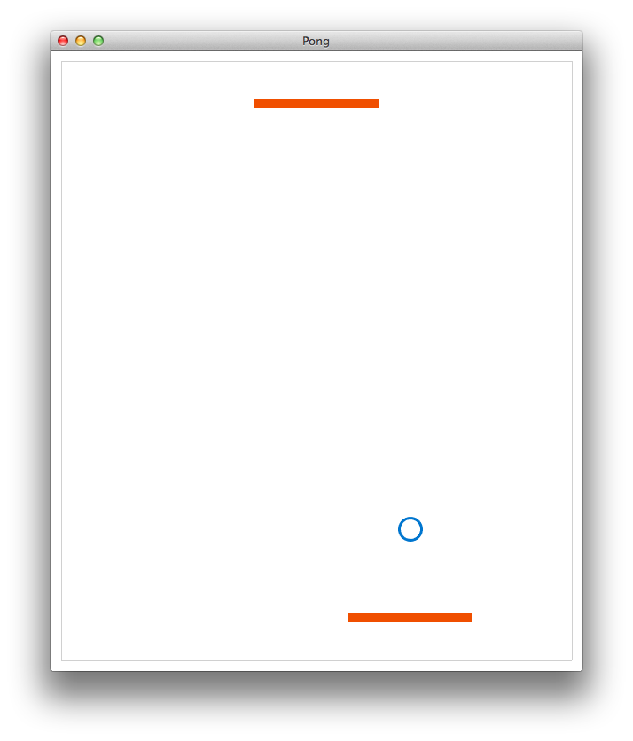

Pong
====

Prosta gra sieciowa - Pong dla 2 graczy. Wykonana w ramach przedmiotu Sieci Komputerowe 2 na Politechnice Poznańskiej (prowadziący [mgr inż. Maurycy Zamorski](http://www.cs.put.poznan.pl/mzamorski/))

It uses **Box2d** as physics engine and **SFML** as multimedia library.

### Kompilacja
```
make
```

### Uruchomienie
#### Serwer

Domyślny serwer (port <code>4000</code>).
```
./pong -s
```

Serwer działający pod konkretnym portem
```
./pong -s port_number
```

#### Klient

Domyślny klient (port <code>4000</code>, server address <code>127.0.0.1</code>).
```
./pong -c
```

Klient łączący się z konkretnym adresem oraz portem
```
./pong -c 127.0.0.1 5000
```

### Zrzuty aplikacji


